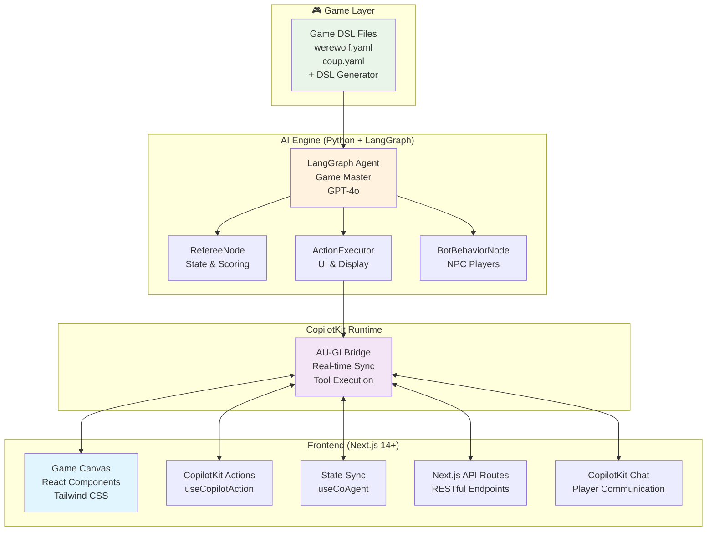

# 🎮 Reusable LLM Game Engine

<div align="center">

**DSL-Driven, Zero-Code Game Platform**  
*Add new games by one sentence, not code*

</div>

**Documentation:**  [https://docs.google.com/document/d/1CugOHIvGYZ7J339M6bQpwU7fyY-Dg1BHJ__HTwXXYDA/edit?usp=drive_link](https://docs.google.com/document/d/1CugOHIvGYZ7J339M6bQpwU7fyY-Dg1BHJ__HTwXXYDA/edit?usp=drive_link)

**Demo Video:**  [https://drive.google.com/file/d/18px28PHM45-oy7GmVgpQ5uknrBUTeqyM/view?usp=sharing](https://drive.google.com/file/d/18px28PHM45-oy7GmVgpQ5uknrBUTeqyM/view?usp=sharing)


## What Makes This Special

This is **not just another game platform**. It's a **reusable LLM game engine** where games are described in YAML DSL files, not programmed. Add new games by writing configuration files, not code.

### Core Philosophy
- **One-Sentence Game Creation**: Generate complete games from simple text descriptions
- **DSL-First**: Games defined in human-readable YAML files
- **Zero Game-Specific Code**: No `if game === "werewolf"` conditions anywhere
- **Atomic Operations**: Generic tools work across all game types
- **AI Game Master**: Intelligent host that understands rules and guides players
- **Real-time Synchronization**: Frontend and backend stay perfectly in sync

## 🚀 Quick Start

### Prerequisites
- Node.js 18+ 
- Python 3.12+
- pnpm (recommended) or npm/yarn/bun
- OpenAI API Key

### Installation

1. **Clone and install dependencies:**
```bash
git clone https://github.com/liruihan000/game_engine.git
cd game_engine
pnpm install  # This also installs Python dependencies
```

2. **Set up OpenAI API key:**
```bash
echo 'OPENAI_API_KEY=your-openai-api-key-here' > agent/.env
```

3. **Start the game engine:**
```bash
pnpm dev  # Runs both UI (:3000) and agent (:8123)
```

4. **Play your first game!**
   - Navigate to http://localhost:3000
   - Select a game (Werewolf, Two Truths and a Lie, etc.)
   - The AI game master will guide you through everything


## Architecture



## 🔧 Available Scripts

```bash
# Development
pnpm dev          # Start both UI and agent servers
pnpm dev:ui       # Frontend only (:3000)
pnpm dev:agent    # Backend only (:8123)

# Production
pnpm build        # Build for production
pnpm start        # Start production server

# Utilities  
pnpm lint         # Code linting
pnpm install:agent # Reinstall Python dependencies
```

## 🎯 How It Works

### 1. **DSL-Driven Game Logic**
Games can be generated from simple text descriptions, or manually defined in YAML files with phases, actions, and rules:

```yaml
# games/werewolf.yaml
declaration:
  name: "Werewolf"
  min_players: 4
  max_players: 12
  roles:
    - name: "Werewolf"
      count: 1
      description: "Eliminate villagers during night phases"
    - name: "Villager"  
      count: "remaining"
      description: "Find and eliminate werewolves"

phases:
  0:
    name: "Role Assignment"
    description: "Secretly assign roles to players"
    actions: ["assign_roles", "display_roles"]
  1:
    name: "Day Discussion"
    description: "Players discuss and vote to eliminate"
    actions: ["open_discussion", "voting_panel"]
```

### 2. **Intelligent AI Game Master**
The LangGraph agent acts as an intelligent game master that:
- **Understands rules** from DSL files
- **Guides players** through each phase
- **Manages state** and scoring automatically
- **Creates UI components** dynamically
- **Handles NPC players** with realistic behavior

### 3. **Real-time UI Synchronization**
Frontend and backend stay perfectly synchronized:

```typescript
// Frontend tools are exposed to the AI agent
useCopilotAction({
  name: "createVotingPanel",
  description: "Display voting interface",
  available: "remote",
  parameters: [
    { name: "options", type: "array", required: true },
    { name: "audience_ids", type: "array", required: true }
  ],
  handler: ({ options, audience_ids }) => {
    // AI calls this to create voting UI
    updateGameState({ votingPanel: { options, audience_ids } });
  }
});
```


## ➕ Adding New Games

### 🚀 DSL Generator (Recommended)

**Generate games with a single sentence!** Our AI-powered DSL Generator creates complete game configurations from simple descriptions.

1. **Start the game engine**: `pnpm dev`
2. **Open DSL Generator**: Navigate to the DSL Generator section in the frontend
3. **Describe your game**: 
   - **Title**: "Spy Hunt"
   - **Description**: "Players try to identify the spy among them by asking questions, while the spy tries to blend in without revealing their identity"
4. **Wait 2-3 minutes**: The AI will generate a complete DSL file
5. **Play immediately**: Your new game is ready to play!

**Examples of one-sentence game descriptions:**
- *"A bluffing game where players claim to have certain cards and others can challenge them"*
- *"Players take turns telling stories and others vote on which story is the most creative"*  
- *"A memory game where players must repeat an increasing sequence of actions"*
- *"Players work together to solve puzzles before time runs out"*


   ```
3. **Test**: The AI game master will automatically understand and run your game!

### 🔧 Advanced Features

For complex games, you can specify:
- **Dynamic roles** with conditional counts
- **Multi-stage phases** with sub-actions  
- **Conditional logic** based on game state
- **Victory conditions** and scoring rules
- **Special actions** for different roles

## 🏆 Success Stories

- **90%+ completion rate** across diverse game types
- **Zero game-specific code** - everything is reusable
- **Sub-second response times** for state synchronization
- **Scalable architecture** - designed for 12+ players with scaling framework ready

## 🛠️ Technical Deep Dive

### State Management
```typescript
interface AgentState {
  items: UIComponent[];           // Visual game components
  player_states: PlayerStates;    // Current player data  
  current_phase_id: number;      // Active game phase
  playerActions: ActionHistory;   // Player action log
  dsl: GameDSL;                  // Loaded game rules
  chatMessages: ChatMessage[];    // Game communication
}
```

### AI Agent Nodes
- **ActionExecutor**: Creates and manages UI components
- **RefereeNode**: Updates player states and scoring
- **BotBehaviorNode**: Controls NPC player behavior
- **PhaseNode**: Manages game flow and transitions

### Frontend-Backend Architecture

**Frontend Stack (Next.js):**
- **Next.js 14+**: Full-stack React framework with API routes
- **CopilotKit**: Real-time AI integration and state synchronization
- **Tailwind CSS**: Utility-first styling with shadcn/ui components
- **TypeScript**: Type-safe development with strict typing

**Backend Stack (Python):**
- **LangGraph**: AI agent workflow orchestration
- **OpenAI GPT-4o**: Large language model for game mastering
- **FastAPI**: High-performance async API endpoints
- **YAML DSL**: Human-readable game configuration files

### Real-time Synchronization
```typescript
// Frontend-Backend sync via CopilotKit
const { state, setState } = useCoAgent<AgentState>({
  name: "game_agent",
  initialState
});

// Bi-directional flow:
// Frontend → setState() → CopilotKit → LangGraph Agent
// Agent → createVotingPanel() → CopilotKit → Frontend UI Update
```


**Python dependency issues:**
```bash
cd agent
rm -rf .venv
python -m venv .venv --clear
.venv/bin/pip install -r requirements.txt
```

**State sync problems:**
- Check browser console for WebSocket errors
- Verify OpenAI API key is set correctly
- Ensure both servers started successfully


<div align="center">

**Built with using CopilotKit + LangGraph**

*Turn your game ideas into reality with just a YAML file*

[🎮 Start Playing](#quick-start) • [📖 Read Docs](#documentation) • [🤝 Contribute](#contributing)

</div>
